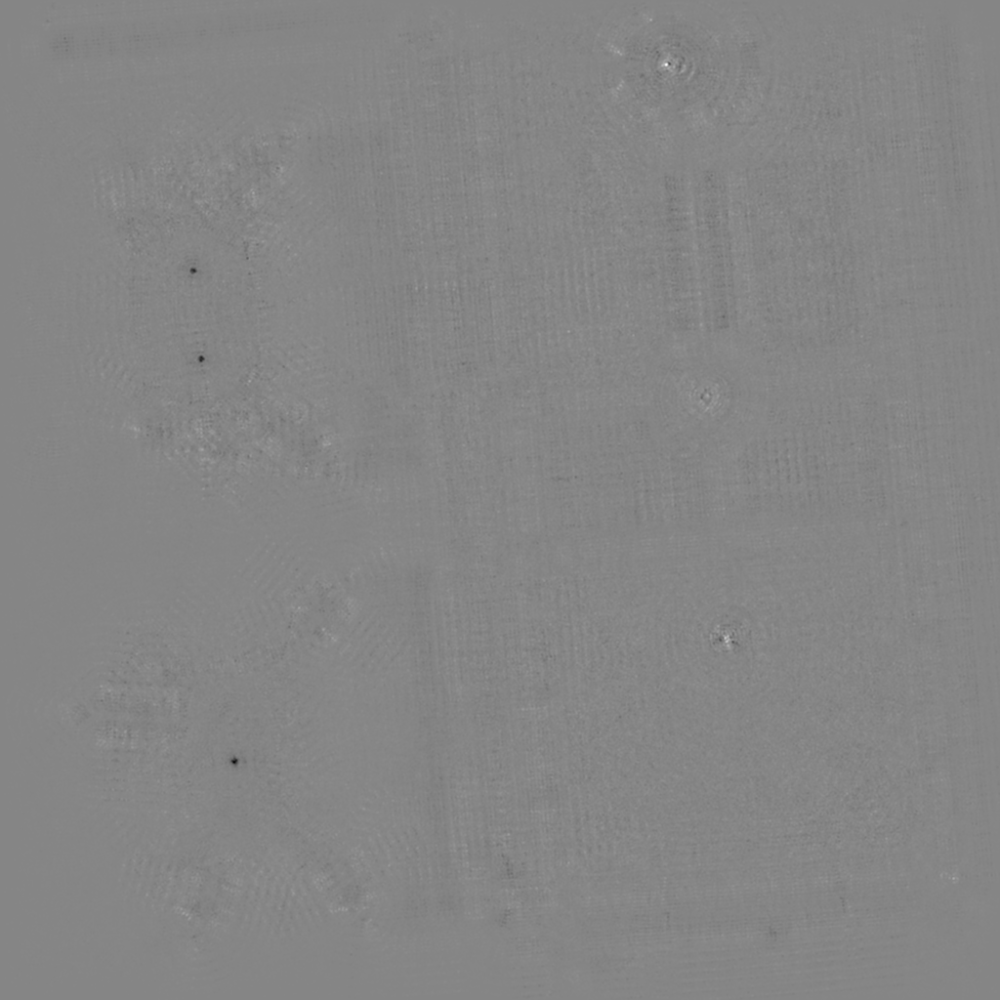

> Developed with [Giuseppe Marino](https://github.com/giuseppe16180)

## Fast radial symmetry

The [fast radial symmetry](https://pdfs.semanticscholar.org/2c21/e4808dcb8f9d935d98af07d733b8134525ab.pdf) algorithm highligths the central points of circles in an image.

Each pixel is interpreted as if it was part of a circumference. The angle of the pixel's gradient is used to calculate where, for a given radius, the theoretical center of the circle would fall. This point is registered in a separate matrix. The same happens for the angle in the opposite direction (rotated by pi radians), but it's marked in a different way.
Then, a series of normalizations and filters are used to combine the results obtained with different radii.

### Usage

The implementation works on grayscale images. The second parameter is the list of radii to use. The output is a single image, where a dark spot indicate a circle that's surrounded by a darker area, and where a bright spot indicates a circle that's surrounded by a brighter area.

```matlab
frs = fastradialsymmetry(img, [10:4:26 40:10:90]);
figure; imshow(frs, []);
```

 <br> Original |  <br> Fast radial symmetry
:----:|:----: